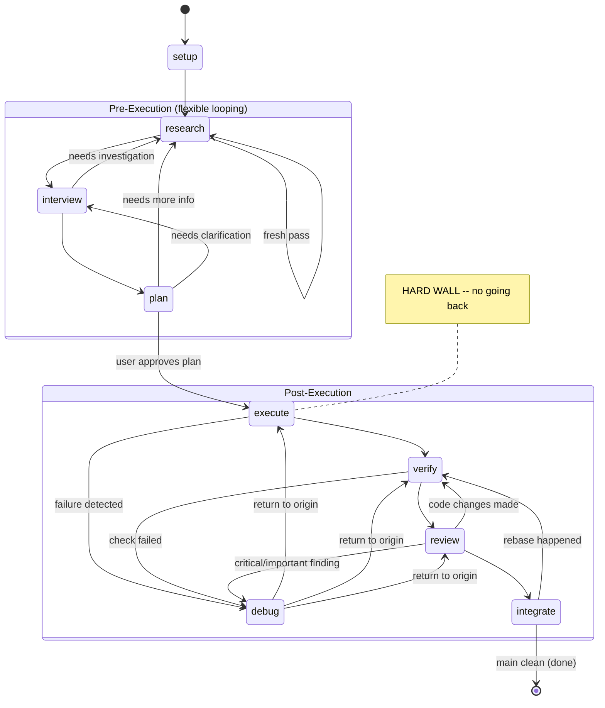

# issue-workflow

A Claude Code plugin that orchestrates autonomous issue-to-PR workflows through an 8-stage state machine. Given a GitHub issue number, it produces a reviewed, tested, integration-ready pull request.

## How It Works

The `work-issue` CLI launches sequential Claude Code sessions, one per stage. Each stage loads a dedicated skill prompt and gets a fresh context window with full access to parallel subagents. This design solves a key constraint: Claude Code subagents cannot spawn sub-subagents, so running each stage as its own top-level session gives every skill maximum parallelism.

## Prerequisites

### GitHub CLI

The workflow uses `gh` extensively. Install and authenticate:

```bash
# Install gh: https://github.com/cli/cli#installation

# Authenticate with a personal access token (PAT) or browser login
gh auth login
```

**Required PAT scopes** (if using a token instead of browser auth):
- `repo` -- full repository access (read issues, create branches, open PRs, push code)
- `read:org` -- read org membership (needed for org-owned repos)
- `project` -- project board access (optional, for project-linked issues)

The workflow uses these `gh` commands: `gh issue view`, `gh repo view`, `gh pr create`, `gh pr comment`, `gh pr ready`.

### Claude Code CLI

Install Claude Code: https://claude.ai/install

Authenticate: `claude auth login`

### Other tools

The orchestrator also requires `git` and `jq` in PATH.

## Installation

### As a Claude Code plugin

```bash
# Add this repo as a marketplace
claude plugin marketplace add 22a435/issue-workflow

# Install the plugin
claude plugin install issue-workflow@issue-workflow --scope user
```

### Setting up the CLI command

The `work-issue` orchestrator needs to be accessible as a CLI command. After installing the plugin, create a symlink or alias:

```bash
# Option A: symlink (find the plugin install path first)
PLUGIN_PATH="$(find ~/.claude -path '*/issue-workflow/bin/work-issue' 2>/dev/null | head -1)"
sudo ln -sf "$PLUGIN_PATH" /usr/local/bin/work-issue

# Option B: shell alias (add to ~/.bashrc or ~/.zshrc)
alias work-issue='bash ~/.claude/plugins/marketplaces/issue-workflow/bin/work-issue'
```

## Quick Start

```bash
# Run the full workflow for issue #42
work-issue 42

# Use a specific model for all stages
work-issue 42 --model sonnet

# Resume from a specific stage
work-issue 42 --resume verify

# Override effort level
work-issue 42 --effort max
```

## Stages

The workflow runs as a **state machine**, not a rigid linear sequence:

```
setup -> research <-> interview <-> plan -> execute <-> debug <-> verify <-> review <-> integrate -> done
```

| Stage | Model (default) | Purpose |
|-------|----------------|---------|
| **setup** | haiku | Create branch, work folder, Issue.md; run repo setup scripts |
| **research** | opus[1m] | Deep codebase, web, and library documentation investigation |
| **interview** | opus[1m] | Resolve open questions with user input |
| **plan** | opus[1m] | Draft implementation plan; requires user approval; opens draft PR |
| **execute** | sonnet[1m] | Implement the plan with parallel subagents |
| **debug** | opus[1m] | Root cause analysis and fix for escalated problems |
| **verify** | sonnet[1m] | Full verification suite (component + integration + tests) |
| **review** | sonnet[1m] | Code quality, security, and documentation review |
| **integrate** | opus[1m] | Rebase onto main; resolve conflicts |

### State Machine



**Hard wall:** Once execution starts, no returning to pre-execution stages (research, interview, plan).

**Stage transitions:** Skills write a stage name to `./claude-work/<issue>/.next-stage` to request non-default transitions. The orchestrator validates and follows the signal.

## Configuration

All configuration is via environment variables. Set them in your shell, `.envrc`, or CI environment.

### Model overrides

```bash
# Override all stages
export ISSUE_WORKFLOW_MODEL=sonnet

# Override specific stages (takes precedence over the global override)
export ISSUE_WORKFLOW_MODEL_RESEARCH=opus[1m]
export ISSUE_WORKFLOW_MODEL_EXECUTE=sonnet[1m]
```

### Effort overrides

```bash
# Override specific stages
export ISSUE_WORKFLOW_EFFORT_RESEARCH=max
export ISSUE_WORKFLOW_EFFORT_EXECUTE=high
```

### Skill prefix

If you have other plugins with conflicting skill names (research, plan, etc.), set a prefix:

```bash
export ISSUE_WORKFLOW_SKILL_PREFIX=issue-workflow:
```

This changes invocations from `/research` to `/issue-workflow:research`.

### All variables

| Variable | Purpose | Default |
|----------|---------|---------|
| `ISSUE_WORKFLOW_MODEL` | Override model for all stages | per-stage defaults |
| `ISSUE_WORKFLOW_MODEL_<STAGE>` | Override model for one stage | per-stage default |
| `ISSUE_WORKFLOW_EFFORT_<STAGE>` | Override effort for one stage | per-stage default |
| `ISSUE_WORKFLOW_SKILL_PREFIX` | Skill name prefix for conflicts | `""` (empty) |
| `CLAUDE_CODE_EFFORT_LEVEL` | Global effort override (existing Claude Code var) | `high` |

## Conventions

### Branching

Feature branches are named `claude/<issue-number>` (e.g., `claude/42`), always branched from `main`.

### Work directory

Each issue gets a work directory at `./claude-work/<issue-number>/` in the repo root. Each stage produces one document:

| Stage | Document |
|-------|----------|
| setup | `Issue.md` |
| research | `Research.md` |
| interview | `Interview.md` |
| plan | `Plan.md` |
| execute | `Execute.md` |
| debug | `Debug.md` |
| verify | `Verify.md` |
| review | `Review.md` |
| integrate | `Integration.md` |

### Document ownership

- Each skill may **read** any prior document but must only **write** to its own document
- When a skill is re-triggered, it **appends** new sections rather than rewriting
- Never delete information from documents -- correct it in-place or add an addendum
- In-place edits are marked: `> [IN-PLACE EDIT during <stage> phase]: <reason>`

### Commits

Format: `claude-work(<stage>): <brief description> [#<issue>]`

Each stage commits and pushes after completion, and posts a summary to the PR thread.

### Subagent cost optimization

The orchestrator assigns different models to different stages. Within each stage, skills should:

- **Downgrade information-gathering agents** (Explore, web research, context7) to `model: "sonnet"`
- **Keep the parent session's model** for implementation agents and reasoning/judgment agents

This is most impactful during research and plan stages, which run on opus but spawn multiple information-gathering subagents.

### Error escalation

During execute, verify, and review: if a problem is found that the stage cannot fix, it documents the failure and signals `debug`. The debug stage investigates root cause, applies a fix, and the orchestrator returns control to the originating stage.

Execute and verify do not attempt fixes. Review only fixes suggestion-level issues directly; critical and important findings are escalated to debug.

### Loop safety

The orchestrator enforces:
- **5 runs maximum per stage** (prompts for confirmation after 5)
- **25 total stage executions** (hard abort to prevent infinite loops)

## Plugin Contents

### Skills (8)

Loaded automatically when the plugin is installed. Invoke individually with `/<skill-name> <issue-number>`:

`/research`, `/interview`, `/plan`, `/execute`, `/debug`, `/verify`, `/review`, `/integrate`

### Hooks

- **Branch protection** (PreToolUse): Blocks `git push` to main/master/production branches. Enforces the feature branch workflow.

### CLI

- **`bin/work-issue`**: The bash orchestrator. Needs to be symlinked or aliased to be accessible from the command line (see Installation).

## License

MIT
